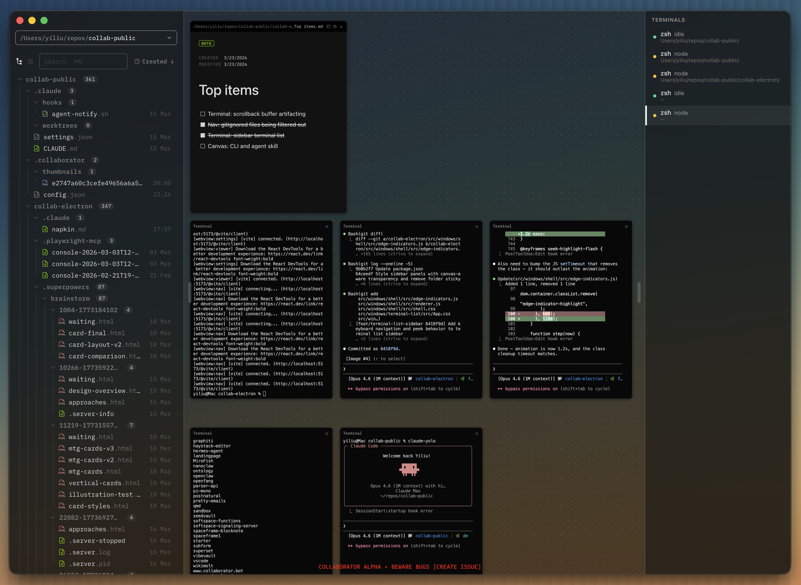

# Collaborator

Collaborator is a place to build with agents.



Collaborator is an end-to-end environment for agentic development. Terminals, context files, and running code — all arranged on an infinite canvas in one place. No context switching, no tab hunting. Just your agents and your work, side by side.

The app is early-stage and in active development. macOS only for now.

## Install

**[Download the latest release](https://github.com/collaborator-ai/collab-public/releases/latest)** (macOS, Apple Silicon)

Or install from the command line:

```sh
curl -fsSL https://raw.githubusercontent.com/collaborator-ai/collab-public/main/install.sh | bash
```

## Stack

Collaborator is a native desktop app built with:

* **Electron 40** — desktop shell with multi-webview architecture

* **React 19** — UI framework

* **Tailwind CSS 4** — styling

* **electron-vite** — build tooling with hot reload

* **xterm.js** — terminal emulation, backed by tmux sessions for persistence

* **Monaco Editor** — code editing with syntax highlighting

* **BlockNote / TipTap** — rich text markdown editing

* **D3** — force-directed graph visualization

* **sharp** — image processing

* **KaTeX** — math rendering in markdown

All data is stored locally on disk.

## Quickstart

1. Open Collaborator

2. Add a workspace — click the workspace dropdown in the navigator and choose "Add workspace", or press Cmd+Shift+O, then select a local folder

3. Double-click the canvas to create a terminal, and start an agent

4. Drag files from the navigator onto the canvas to open them as tiles alongside your running agents

***

## Specification

### Application overview

Collaborator is a single-window application for macOS (arm64). It operates primarily on local files with no accounts required. Anonymous, non-identifying usage analytics are collected via PostHog.

The window is divided into two regions:

* **Navigator** — a resizable sidebar on the left containing a file tree and workspace switcher

* **Main area** — the canvas, an infinite pan-and-zoom surface where tiles are arranged; also hosts the viewer, which displays the content of the file selected in the navigator

All application state is stored as JSON files in `~/.collaborator/`.

### Multiworkspace navigation

The navigator sidebar displays a file tree rooted at the active workspace folder. Users can maintain multiple workspaces and switch between them.

#### Workspace management

A dropdown at the top of the navigator shows the active workspace name. It provides:

* A list of all workspaces for quick switching

* "Add workspace" to open a new local folder (also available via Cmd+Shift+O)

* "Remove workspace" to remove a workspace from the list (does not delete files)

Each workspace gets its own independent file tree. The canvas and viewer are shared across workspaces.

#### File tree

The file tree shows all files and folders in the active workspace. It supports:

* **Expand/collapse** folders by clicking

* **Two view modes**: hierarchical tree view, and a chronological feed view sorted by date

* **Sorting**: cycles through created (newest/oldest), modified (newest/oldest), and name (A-Z/Z-A)

* **File operations**: create new note (generates `Untitled.md`), create new folder, rename (F2), delete (moves to trash)

* **Move files** by dragging between folders

* **Multi-select** with Shift+click and Cmd+click

* **Search** via Cmd+K

Selecting a file in the tree opens it in the viewer. Dragging a file from the tree onto the canvas creates a tile.

### Canvas

The canvas is an infinite pan-and-zoom surface that fills the main area. It uses a dot grid background for spatial orientation.

#### Viewport controls

| Action     | Input                                             |
| ---------- | ------------------------------------------------- |
| Pan        | Scroll wheel, or Space+drag, or middle-click+drag |
| Zoom in    | Cmd+= or Ctrl+scroll up                           |
| Zoom out   | Cmd+- or Ctrl+scroll down                         |
| Reset zoom | Cmd+0                                             |

* **Zoom range**: 33% to 100%, with rubber-band effect when overshooting limits

* **Zoom indicator**: appears briefly in the bottom-right corner after zoom changes, showing the current percentage

#### Grid

* Minor grid dots at regular intervals

* Major grid dots at every 4th interval

* All tile positions and sizes snap to the grid

#### Data model

Tiles are live views, not standalone containers.

* **File tiles** (note, code, image) are bound to a file on disk by absolute path. If the file is renamed, the tile updates to track the new path. If the file is deleted, the tile is closed. If the file's content changes on disk, the tile reloads.

* **Terminal tiles** are bound to a tmux session. Each terminal tile creates and manages its own session, which persists independently of the tile's lifecycle on the canvas.

#### Tile management

Tiles are the content units on the canvas. Each tile has:

* A **title bar** for dragging

* **Eight resize handles** (four edges, four corners)

* A **z-index** for layering — clicking a tile brings it to front

Tiles are created by:

* **Double-clicking** empty canvas space — creates a terminal tile at that position

* **Dragging a file** from the navigator onto the canvas — creates a note, code, or image tile depending on file type

Tiles can be closed via their title bar. Holding Shift while scrolling passes scroll events through tiles to the canvas.

### Tile types

#### Terminal

An interactive terminal session. Created by double-clicking empty canvas space. The terminal's working directory is set to the active workspace path.

Terminals are the primary interface for running AI agents. Each terminal tile manages its own independent session.

#### Note

A rich markdown editor. Created by dragging a `.md` file from the navigator onto the canvas. Supports inline editing with live rendering.

#### Code

A syntax-highlighted code editor. Created by dragging any non-markdown, non-image file from the navigator onto the canvas. Supports inline editing with language detection.

#### Image

A read-only image display. Created by dragging an image file (`.png`, `.jpg`, `.jpeg`, `.gif`, `.svg`, `.webp`) from the navigator onto the canvas.

### Viewer

The viewer displays the content of the currently selected file in the navigator. It occupies the main area alongside the canvas.

| File type                                                | Display                                                                       |
| -------------------------------------------------------- | ----------------------------------------------------------------------------- |
| Markdown (`.md`, `.mdx`, `.markdown`, `.txt`)            | Rich text editor with frontmatter support, cover images, and wiki-style links |
| Code (all other text files)                              | Syntax-highlighted editor with line numbers                                   |
| Image (`.png`, `.jpg`, `.jpeg`, `.gif`, `.svg`, `.webp`) | Image display with metadata                                                   |

Markdown and code files support inline editing in the viewer. The viewer watches for external file changes on disk and reloads automatically.

Pressing Escape closes the viewer (when not actively editing).

### Persistence

All state is stored locally in `~/.collaborator/`.

#### Canvas state (`canvas-state.json`)

```json
{
  "version": 1,
  "tiles": [
    {
      "id": "tile-<timestamp>-<index>",
      "type": "term | note | code | image",
      "x": 0,
      "y": 0,
      "width": 440,
      "height": 540,
      "filePath": "/absolute/path/to/file",
      "zIndex": 1
    }
  ],
  "viewport": {
    "panX": 0,
    "panY": 0,
    "zoom": 1.0
  }
}
```

Canvas state is saved 500ms after each change (debounced) and immediately when tiles are created or closed.

#### App config (`config.json`)

```json
{
  "workspaces": ["/path/to/workspace1", "/path/to/workspace2"],
  "active_workspace": 0,
  "window_state": {
    "x": 0,
    "y": 0,
    "width": 1440,
    "height": 900,
    "isMaximized": false
  },
  "ui": {}
}
```

## Star History

<a href="https://www.star-history.com/?repos=collaborator-ai%2Fcollab-public&type=timeline&legend=top-left">
 <picture>
   <source media="(prefers-color-scheme: dark)" srcset="https://api.star-history.com/image?repos=collaborator-ai/collab-public&type=timeline&theme=dark&legend=top-left" />
   <source media="(prefers-color-scheme: light)" srcset="https://api.star-history.com/image?repos=collaborator-ai/collab-public&type=timeline&legend=top-left" />
   
 </picture>
</a>

## Development | Electron App

### Prerequisites (macOS)

These instructions are for macOS. You'll need a few tools installed before you can run Collaborator locally. All of them can be installed using Homebrew.

#### 1. Homebrew (macOS package manager)

If you don't already have Homebrew, install it first:

```sh
/bin/bash -c "$(curl -fsSL https://raw.githubusercontent.com/Homebrew/install/HEAD/install.sh)"
```

After it finishes, follow any instructions about adding `brew` to your PATH.

#### 2. Node.js (v22+)

```sh
brew install node
```

#### 3. Bun

Bun is used instead of npm for installing packages and running tests:

```sh
brew install oven-sh/bun/bun
```

#### 4. tmux

tmux is the program that powers Collaborator's terminal sessions. Without it, terminals won't work:

```sh
brew install tmux
```

### Setup

Once the prerequisites are installed, clone the repo and install dependencies:

```sh
git clone https://github.com/collaborator-ai/collab-public.git
cd collab-public/collab-electron
bun install
```

### Run in dev mode

```sh
bun run dev
```

This starts the Electron app with hot reload via electron-vite.

### Run tests

```sh
bun test
```

### Build

```sh
bun run build
```

⠀